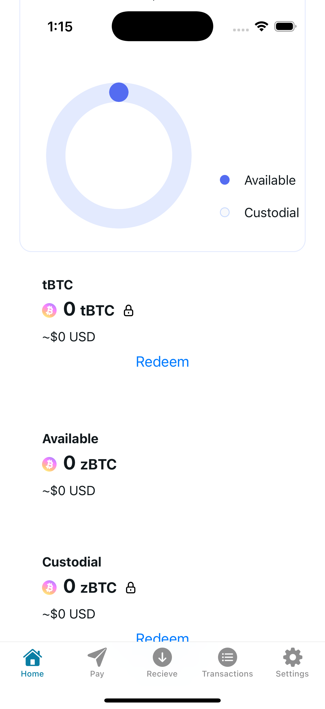
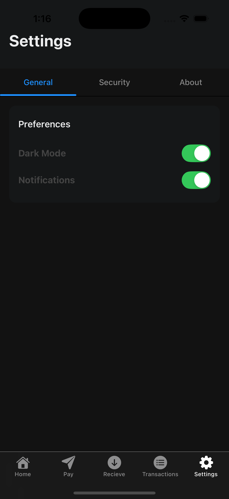
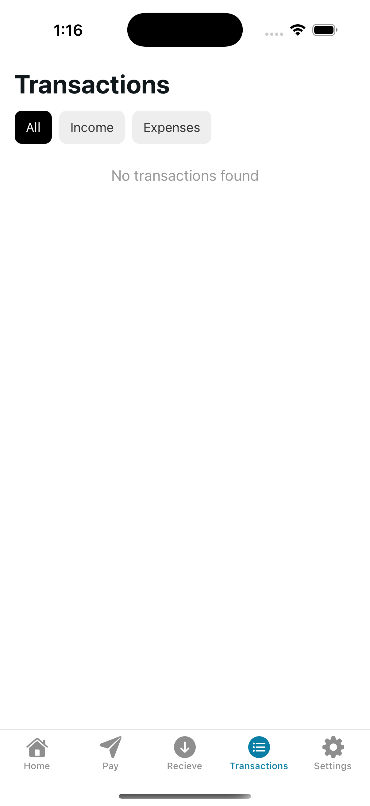
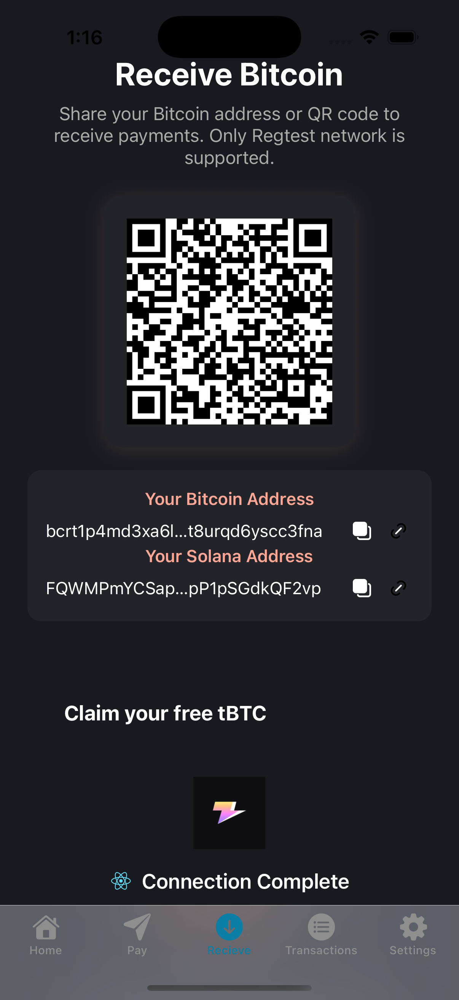

# Zeus Wallet: Solana + Bitcoin Payment App

This is a cross-chain mobile wallet built with Expo/React Native, supporting both Solana and Bitcoin payments. It allows users to send and receive payments, scan QR codes to pay, and manage their balances securely.

## Features
- Solana and Bitcoin wallet support
- Send and receive payments
- Scan QR codes to pay (Solana Pay and Bitcoin BIP21)
- Secure key management (Solana and Bitcoin via in-memory/async storage)
- Transaction history and payment requests

## Getting Started

1. Install dependencies
   ```bash
   npm install
   ```
2. Start the app
   ```bash
   npx expo start
   ```

## Project Structure
- `contexts/` — Wallet providers and hooks for Solana and Bitcoin
- `app/(tabs)/` — Main screens (Home, Pay, Receive, Transactions, Settings)
- `components/` — UI components (Balance, TransactionList, SendForm, etc.)
- `utils/` — Utility functions (formatting, etc.)

## Learn More
- [Solana Pay](https://github.com/solana-labs/solana-pay)
- [Bitcoin BIP21](https://github.com/bitcoin/bips/blob/master/bip-0021.mediawiki)

## App Screenshots

<div style="display: flex; gap: 10px;">
  
  
  
  
</div>

---

This project is a work in progress. Contributions welcome!
